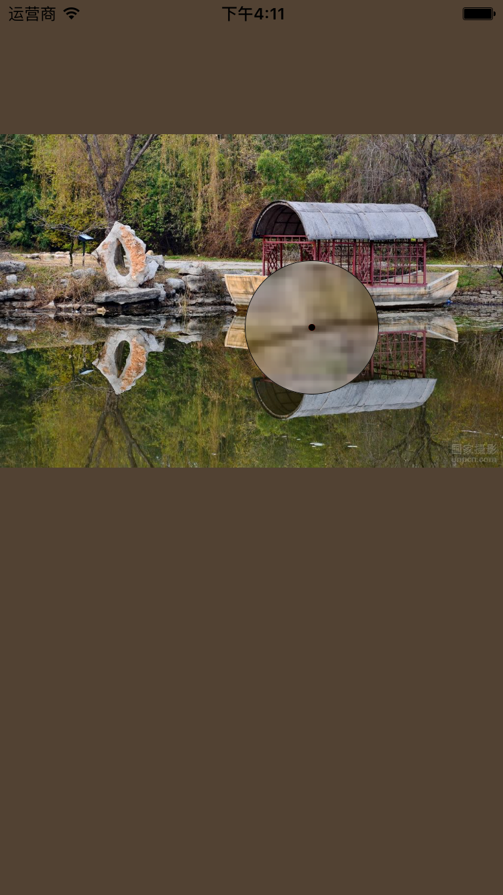
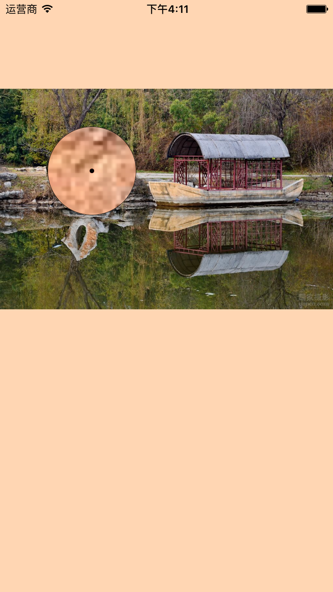

# LLImageColor
	
	llimageColor， get color from image's pixel or point
	
	获取UIImage上某个点的颜色，类似与取色器...

	
# Communication

    1. If you found a bug, and can provide steps to reliably reproduce it, open an issue.
    2. If you have a feature request, open an issue.
    3. If you want to contribute, submit a pull request.

#  Usage
eg

	UIImage *image = [UIImage imageNamed:@"b"];
    
    CGFloat iwidth = CGRectGetWidth(self.view.frame);
    CGFloat rota = iwidth / image.size.width;
    CGFloat iheight = rota * image.size.height;
    
    UIImageView *imageView = [[UIImageView alloc] initWithFrame:CGRectMake(0.0, 100, iwidth, iheight)];
	//    UIImageView *imageView = [[UIImageView alloc] initWithImage:image];
    imageView.backgroundColor = [UIColor redColor];
    imageView.image = image;
    [self.view addSubview:imageView];
    
    _moveShowView = [[LLViewMoveShow alloc] initWithFrame:CGRectMake(0.0, 0.0, 100.0, 100.0)];
    [_moveShowView setCircle];
    [imageView addSubview:_moveShowView];
    
    __weak LLViewMoveShow *weakMoveShow = _moveShowView;
    weakMoveShow.centerPoint = ^(CGPoint point) {
        // 调整point的坐标，因为imageView，可能做了放大缩小等操作, 如果没有缩放图片，则不需要做一个rota处理
        point = CGPointMake(point.x / rota * 2, point.y / rota * 2);
        // 未缩放的模式
        //        point = CGPointMake(point.x * 2, point.y * 2);
        
        self.view.backgroundColor = [LLImageColorByPixel getImagePixelColorByCGImageRef:imageView.image.CGImage withPoint:point];
    };
	}

	- (void)touchesBegan:(NSSet<UITouch *> *)touches withEvent:(UIEvent *)event {
    	[_moveShowView touchesBegan:touches withEvent:event];
    }

	- (void)touchesMoved:(NSSet<UITouch *> *)touches withEvent:(UIEvent *)event {
		[_moveShowView touchesMoved:touches withEvent:event];
    }
